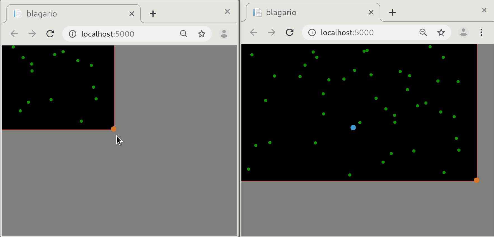

# Blagario project

This is just an experimental lab to test to make a multiplayer web game without javascript (or almost without). Components:

* blazor ( netcore 3.0.100 )
* html
* css

Maybe a more simple game (pong, snake, space invaders ) would be enough to make the lab ... but ... let's try.

This is not a real project, just a lab to enjoy and for experimental purposes (check performance, refresh, network bandwidth, learn new blazor features, ... ).

### How it works?

* All elements ( cell, viruses, world, pellets, W) are simple C# classes.
* Each element has a `Tic` method who makes game move on.
* They are a `HostedService` who calls the `Tic`s.
* `Universe` is injected as `AddSingleton`: one Universe for all people.
* `Player` is injected as `Scoped`: one Cell for Player (connection).
* Mouse is tracked by blazor ( `@onmousemove`'s `MouseEventArgs` )

### Collaboration wanted:

[See todo list and make PR's](https://github.com/ctrl-alt-d/Blagario/issues/1)

Make PR to this report and contribute to [hacktoberfest](https://hacktoberfest.digitalocean.com/)

*Two gamers, two cells*
